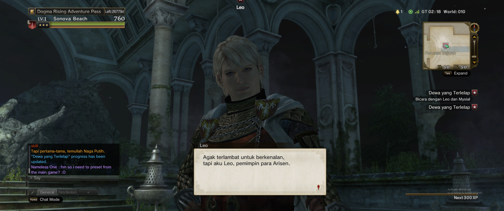
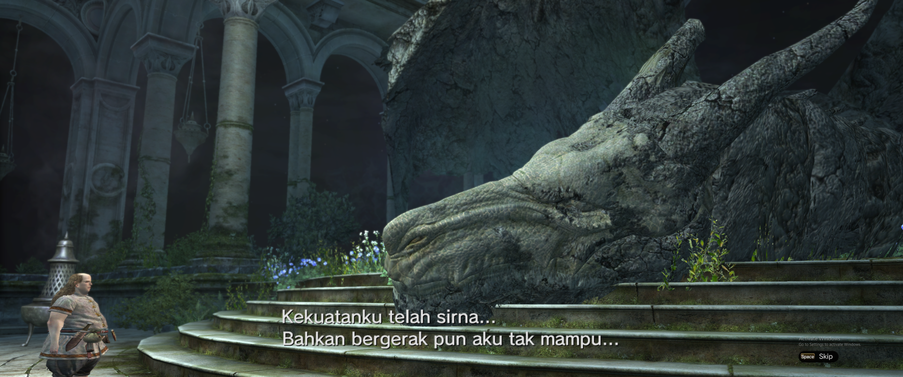

# Dragon's Dogma Online — Bahasa Indonesia

Terjemahan subtitle, percakapan, dan quest ke Bahasa Indonesia.

**[Download game — Dogma Rising](https://play.dogmarising.org/)**

**[⬇ Download ZIP terjemahan — 1,34 GB](https://github.com/playersatujoin/DDON-Indonesia/releases/download/v1.0.0/DDON-Indonesia-v1.0.0.zip)**

## Cara pasang

1. **Tutup game dan launcher.** Salin folder `nativePC` game ke tempat lain sebagai cadangan.
2. **Ekstrak ZIP** yang sudah diunduh, lalu buka folder `patch`.
3. **Copy atau drag folder `nativePC`** dari `patch` ke folder game yang berisi `DDO.exe`.
4. Pilih **Replace / Ganti file**, tunggu selesai, lalu **jalankan game**.

Selesai! Tidak perlu menjalankan skrip.

Gabungkan dengan folder `nativePC` yang sudah ada; jangan menghapus folder game tersebut. Gunakan client English yang cocok dengan patch ini. Mod lain pada file yang sama bisa tertimpa.

## Kembali ke English

Tutup game, lalu pulihkan file yang diganti menggunakan cadangan Anda.

---

[Installer otomatis & panduan lengkap](Panduan-Pemasangan.txt) · [Catatan rilis](https://github.com/playersatujoin/DDON-Indonesia/releases/tag/v1.0.0) · [Laporkan masalah](https://github.com/playersatujoin/DDON-Indonesia/issues)
